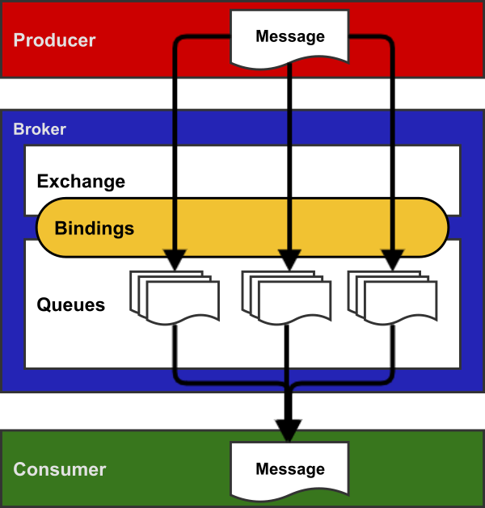
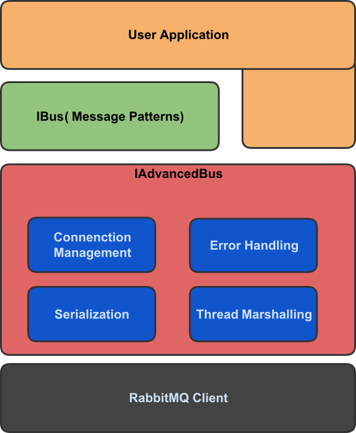

# Vorbereitung

Für den Workshop werden Grundkenntnisse im Umgang mit RabbitMQ und der .NET-Bibliothek EasyNetQ vorausgesetzt.
Auf dieser Seite und den verknüpften Beispielprojekten könnt ihr diese Kenntnisse erhalten oder auffrischen.

# RabbitMQ
## Was ist RabbitMQ?
- Message Broker / Queue Manager
    - System um Queues zu verwalten
    - Nachrichten von Systemen empfangen
    - Nachrichten zwischenspeichern
    - Nachrichten nach Regeln an Systeme zustellen
- Erstellt in <a href="https://de.wikipedia.org/w/index.php?title=Erlang_(Programmiersprache)" target="_blank"> Erlang / OTP</a>
- Erlaubt Entkopplung von unterschiedlichen und unabhängigen Anwendungen

## Begriffe

Bezeichnung | Beschreibung
------------ | -------------
AMQP (Advanced Message Queuing Protocol) | Protokoll zur Kommunikation über Systemgrenzen
Produzent (Producer) | Anwendung, die eine Nachricht erstellt
Konsument (Consumer) | Anwendung, die eine Nachricht empfängt
Nachricht (Message) | Information, die zwischen Produzent und Konsument ausgetauscht wird
Warteschlange (Queue) | Speichert die Nachrichten zwischen
Verbindung (Connection) | TCP Netzwerkverbindung zwischen Anwendung und RabbitMQ Broker
Channel | Virtuelle Verbindung innerhalb der TCP-Verbindung
Exchange | Nimmt eine Nachricht an und leitet sie in keine, eine oder mehrere Warteschlagen
Binding | Verknüpfung zwischen Queue und Exchange
Routing key | "Adresse", nach welcher der Exchange entscheidet, in welche Queue er die Nachricht leitet.
Benutzer (User) | - Zugangsdaten (Benutzername / Password) für RabbitMQ  - Zuordnung von Rechten (Lesen, Schreiben, Konfigurieren etc.)  - Definition global oder für einen spezifischen virtuellen Host
Vhost (virtual host) | Erlaubt, Anwendung auf einer RabbitMQ Instanz zu isolieren

## Exchanges
Je nach Anwendungsfall kommen verschiedene Exchange-Typen zum Einsatz.
- Fanout Exchange
    - Eingehende Nachrichten werden an alle verbunden Queues gesendet
    - Keine Beachtung der Binding-Konfiguration
- Direct Exchange
    - Producer erstellt Routing Key
    - Binding Key der Queue muss exakt passen
- Topic
    - Ähnlich dem Direct Exchange
    - Einsatz von Platzhaltern, z.B. Wort (*) / mehrere Worte (#)
- Header Exchange
    - Routing anhand von Headerinformationen der Nachricht

## Nachrichtentransport
TBD: Beschreibung für Nachrichtentransport

 
# EasyNetQ
EasyNetQ ist eine .Net Bibliothek die den Zugriff auf RabbitMQ gestartet. Sie baut dabei auf die Standardibliothek von RabbitMQ auf.

Dabei ist EasyNetQ:
- Einfach
- Open Source (Github: <a href="https://github.com/EasyNetQ/EasyNetQ" target="_blank">https://github.com/EasyNetQ/EasyNetQ</a>)
- Modular

## Funktionen
- Messaging Pattern, z.B. Publish/Subscriber
- Routing Strategien
- Serialisierung / Deserialisierung als JSON (lesbar)
- Handling von Thread für Konsumenten
- Subscriber Reconnect
- QoS / publisher confirm
- Fehlerbehandlung

## API Design
TBD: Beschreibung für API

## Beispiele
Für alle Beispiele wird eine aktive Instanz des RabbitMQ benötigt. Im Workshop und auch für die Verbereitung empfehle ich RabbitMQ als Docker-Conatiner zu starten.
Als Dockerumgebung unter Windows eignet sich z.B. <a href="https://www.docker.com/products/docker-toolbox" target="_blank">Docker-Toolbox</a> oder <a href="https://docs.docker.com/docker-for-windows/" target="_blank"> Docker for Windows</a>.

Die Instanz wird mit dem folgenden Befehl gestartet:

    docker run -d --hostname myRabbit --name myRabbit -p 5672:5672 -p 15672:15672 rabbitmq:3-management

In der gestarteten Instanz ist auch das Management Plugin aktiv (<a href="https://www.rabbitmq.com/management.html" alt="Infoseite Management PlugIn" target="_blank">Infos</a>) . Zur Anzeige der Management-Oberfläche bitte im Webbrowser <a href="http://localhost:15672" target="_blank"> http://localhost:15672</a> aufrufen. Benutzername und Passwort sind per Default guest:guest.

Wichtig: alle Beispiele sind mit .Net Core erstellt. Das benötigte Nuget-Paket ist noch eine Vorabversion und kann auf MyGet abgerufen werden. Dazu bitte eine Paketquelle mit der Url https://www.myget.org/F/easynetq-unstable/api/v3/index.json im Visual Studio ergänzen.

- <a href="Connecting/">Verbindungaufbau</a>
- Messaging Pattern
    - <a href="PublishSubscribe/">Publish - Subscribe</a>
    - <a href="RequestResponse/">Request - Response</a>
    - <a href="TopicBasedRouting/">Topic Based Routing</a>